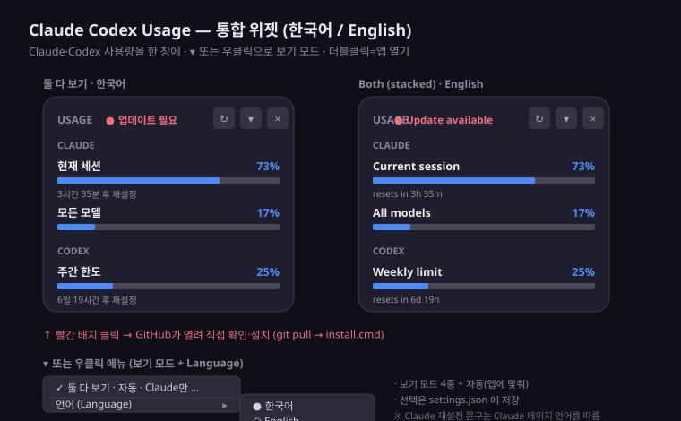

# Claude Codex Usage for Windows

[English](#english) · [한국어](#한국어)

A small always-on-top Windows widget that shows **Claude and Codex usage
together** just above the taskbar. It combines
[`claude-usage`](https://github.com/minsk8775/claude-usage) (Claude) and
[`codex-usage`](https://github.com/minsk8775/codex-usage) (Codex) into one widget
with four view modes.

```text
┌──────────────────────────┐
│ USAGE          ↻ ▾ ×     │
│ CLAUDE                   │
│ 현재 세션            73%  │
│ ██████████████████░░░░░░ │
│ 3시간 35분 후 재설정       │
│ 모든 모델             17%  │
│ ████░░░░░░░░░░░░░░░░░░░░░ │
│ CODEX                    │
│ 주간 한도             25%  │
│ ██████░░░░░░░░░░░░░░░░░░░ │
│ 6일 19시간 후 재설정       │
└──────────────────────────┘
```



The combined widget (both stacked) in Korean and English, showing the
`● 업데이트 필요 / ● Update available` badge and the right-click menu (view modes +
**Language**).

## View modes

Pick a mode from the **`▾` button** (between `↻` and `×`), by **right-clicking
anywhere on the widget**, or from the notification-area icon:

- **자동 (auto)** — follow the running apps: only Claude open → Claude only,
  only ChatGPT open → Codex only, both open → both stacked (default). When both
  apps are closed the window hides itself, and it comes back when either app
  opens again.
- **둘 다 보기 (both, stacked)** — Claude and Codex in one window
- **둘 다 (좌우 전환)** — one at a time, flip with the `‹ ›` arrows
- **Claude만** — Claude only
- **Codex만** — Codex only

In auto mode the widget appears and hides on its own with the apps; a running
background watcher also opens it when an app starts even if the widget was closed.

---

## English

### How it reads usage

- **Claude** (`usage.py`) opens Claude's official `Settings → Usage` page in a
  dedicated Chrome/Edge profile and reads only the rendered meters. It never
  reads cookies or tokens. First use needs a one-time sign-in.
- **Codex** (`codex_usage.py`) reads the rate-limit snapshot the Codex CLI writes
  locally under `~/.codex/sessions`. No browser, no login.

Neither calls a model, so checking usage consumes no quota.

### Requirements

- Windows 10 or Windows 11
- Chrome or Edge (for the Claude meter)
- The [Codex CLI](https://github.com/openai/codex), used at least once (for the
  Codex meter)
- Python 3, or [uv](https://docs.astral.sh/uv/) (either is enough; `uv` optional)
- Git, to let the widget update itself

### Installation

```cmd
git clone https://github.com/minsk8775/Claude-Codex-usage.git
cd Claude-Codex-usage
install.cmd
```

Administrator privileges are not required. The installer creates a desktop
shortcut and a Startup entry and starts the widget once.

### First Claude connection

1. Switch to a view that shows Claude, click `↻`.
2. Sign in to Claude in the dedicated browser window that opens.
3. After `Settings → Usage` appears, click `↻` again.

Codex needs no sign-in — just have used the Codex CLI at least once.

### Controls

| Action | Control |
| --- | --- |
| Move the widget | Drag anywhere except the buttons and the resize grip |
| Resize | Drag the bottom-right grip, or `Ctrl` + mouse wheel |
| Change view mode | Click `▾`, right-click anywhere on the widget, or right-click the notification icon |
| Open the app | Double-click Claude's area → the Claude app; Codex's area → the ChatGPT app. Installed apps are focused or launched (they are Store apps launched by AUMID); if an app is not installed its website opens instead |
| Sync now | Click `↻` |
| Hide / show | Click `×`, or left-click the notification icon |
| Always on top on/off | Right-click the notification icon → `Always on top` |
| Language (KO/EN) | Right-click anywhere (or the notification icon) → `Language` → `한국어` / `English` |
| Exit | Right-click the notification icon → `Exit` |

Percent is **used** (the bar fills as you consume quota). A moved widget keeps
its bottom edge fixed when the height changes between modes.

The interface ships in **Korean and English**; switch under the right-click
`Language` submenu. The choice is saved. (Claude's own reset text is read from
its page and follows your Claude account language.)

### Update notifications (no auto-install)

The widget **never installs updates by itself.** When the folder is a Git
checkout, it does one read-only check shortly after start (`git fetch`, no
checkout) against the official repository. If newer widget code exists, a red
**`● 업데이트 필요`** badge appears in the header next to the buttons. Click it to
open the project on GitHub, review the changes, and install them yourself:

```cmd
git pull
install.cmd
```

Because nothing is downloaded-and-run automatically, a compromised or repointed
remote cannot push code onto your machine. Turn the check off entirely with
`CLAUDE_CODEX_NO_UPDATE=1` or an empty `.noupdate` file next to
`claude_usage.pyw`.

### Security

It never reads cookies, tokens, or credential files — only the rendered usage
meters (Claude) and the local rate-limit snapshot the Codex CLI already wrote. It
makes no inbound connections and opens no off-host ports: the browser debug port
is loopback-only and origin-restricted, and the widget's control ports
(`127.0.0.1:47671/47672`) take a fixed set of commands, never a shell. It never
auto-installs updates — it only checks and notifies, and you install manually. See
[`SECURITY.md`](SECURITY.md) for the full trust model, hardening, and how to report
an issue.

### Project files

| File | Purpose |
| --- | --- |
| `claude_usage.pyw` | The combined widget UI, notification icon, view modes |
| `usage.py` | Claude usage from the official Usage page (browser) |
| `codex_usage.py` | Codex usage from local `~/.codex` session logs |
| `install.py` / `install.cmd` | Shortcut creation / installation |
| `uninstall.cmd` | Removes automatic startup and shortcuts |
| `cleanup-legacy.cmd` | Stops and unregisters the older standalone widgets |
| `assets/claude-usage.ico` | Widget icon |

### License

MIT

---

## 한국어

Claude와 Codex 사용량을 **한 위젯에서 함께** 작업표시줄 위에 보여주는 Windows용
도구입니다. [`claude-usage`](https://github.com/minsk8775/claude-usage)(Claude)와
[`codex-usage`](https://github.com/minsk8775/codex-usage)(Codex)를 하나로 합쳐
네 가지 보기 모드를 제공합니다.

### 보기 모드

`↻`와 `×` 사이의 **`▾` 버튼**을 누르거나 알림 영역 아이콘을 우클릭해 고릅니다:

- **둘 다 보기** — Claude·Codex를 한 창에 세로로 (기본값)
- **둘 다 (좌우 전환)** — 한 번에 하나씩, `‹ ›` 화살표로 전환
- **Claude만** / **Codex만** — 한쪽만

### 사용량을 읽는 방식

- **Claude** (`usage.py`): 전용 Chrome/Edge로 Claude 공식 `설정 → 사용량`
  페이지의 렌더링된 값만 읽습니다. 쿠키·토큰은 읽지 않으며 최초 1회 로그인 필요.
- **Codex** (`codex_usage.py`): Codex CLI가 `~/.codex/sessions`에 남긴 rate-limit
  스냅샷을 로컬에서 읽습니다. 브라우저·로그인 불필요.

모델을 호출하지 않으므로 사용량 확인으로 할당량이 소모되지 않습니다.

### 언어 (한국어 / English)

인터페이스는 **한국어와 영어**를 지원합니다. 창 아무 곳 또는 알림 아이콘을 우클릭 →
`언어 (Language)` → `한국어` / `English` 로 전환하며 선택은 저장됩니다. (Claude 쪽
재설정 문구는 Claude 페이지에서 읽어 오므로 Claude 계정 언어를 따릅니다.)

### 보안

쿠키·토큰·자격 증명 파일은 읽지 않으며, 렌더링된 사용량 값(Claude)과 Codex CLI가
로컬에 남긴 rate-limit 스냅샷만 봅니다. 외부에서 접근 가능한 포트를 열지 않습니다 —
브라우저 디버그 포트는 loopback 전용에 origin 제한(`http://localhost`)이 걸려 있고,
위젯 제어 포트(`127.0.0.1:47671/47672`)는 셸이 아니라 고정된 명령 집합만 받습니다.
업데이트는 **자동 설치하지 않습니다.** 시작 시 읽기 전용으로 한 번만 확인(`git
fetch`)하고, 새 버전이 있으면 헤더에 빨간 **`● 업데이트 필요`** 배지를 띄웁니다.
클릭하면 GitHub가 열려 직접 확인·설치(`git pull` 후 `install.cmd`)합니다. 다운로드한
코드를 자동 실행하지 않으므로 origin이 바뀌거나 저장소가 탈취돼도 임의 코드가 내
컴퓨터에서 실행되지 않습니다. `CLAUDE_CODEX_NO_UPDATE=1` 또는 `.noupdate` 파일로
확인 자체를 끌 수 있습니다. 전체 신뢰 모델·강화 내역·신고 방법은
[`SECURITY.md`](SECURITY.md) 참고.

### 요구 사항

- Windows 10 또는 11
- Chrome 또는 Edge (Claude 미터용)
- [Codex CLI](https://github.com/openai/codex), 최소 한 번 사용 (Codex 미터용)
- Python 3 또는 [uv](https://docs.astral.sh/uv/) (둘 중 하나, `uv`는 선택)
- Git (자동 업데이트에 필요)

### 설치

```cmd
git clone https://github.com/minsk8775/Claude-Codex-usage.git
cd Claude-Codex-usage
install.cmd
```

관리자 권한은 필요 없습니다. 바탕화면·시작프로그램 바로가기를 만들고 위젯을 한 번
실행합니다.

### 최초 Claude 연결

1. Claude가 보이는 모드에서 `↻`를 누릅니다.
2. 열리는 전용 브라우저 창에서 Claude에 로그인합니다.
3. `설정 → 사용량`이 나타나면 `↻`를 다시 누릅니다.

Codex는 로그인 불필요 — Codex CLI를 한 번이라도 썼으면 됩니다.

### 버튼과 조작

| 동작 | 방법 |
| --- | --- |
| 위치 옮기기 | 버튼·크기 손잡이 제외한 아무 곳 드래그 |
| 크기 조절 | 오른쪽 아래 손잡이 또는 `Ctrl` + 마우스 휠 |
| 보기 모드 변경 | `▾` 클릭, **창 아무 곳 우클릭**, 또는 알림 아이콘 우클릭 |
| 앱 열기 | 더블클릭 — Claude 쪽→Claude 앱, Codex 쪽→ChatGPT 앱. 실행 중이면 포커스, 꺼져 있으면 실행(둘 다 Store 앱이라 AUMID로 띄움). 앱이 없을 때만 사이트로 |
| 즉시 동기화 | `↻` |
| 숨기기/표시 | `×` 또는 알림 아이콘 왼쪽 클릭 |
| 항상 위 켜기/끄기 | 알림 아이콘 우클릭 → `항상 위` (끄면 일반 창처럼 뒤로 내려감) |
| 언어 (한/영) | 창 아무 곳(또는 알림 아이콘) 우클릭 → `언어 (Language)` → `한국어` / `English` |
| 완전 종료 | 알림 아이콘 우클릭 → `종료` |

퍼센트는 **사용량 기준**(쓸수록 막대가 참)입니다. 창을 옮겨 둔 경우, 모드에 따라
높이가 바뀌어도 아래 모서리가 고정됩니다.

### 파일 구성

| 파일 | 역할 |
| --- | --- |
| `claude_usage.pyw` | 통합 위젯 UI, 알림 아이콘, 보기 모드 |
| `usage.py` | Claude 공식 Usage 페이지에서 사용량 읽기(브라우저) |
| `codex_usage.py` | 로컬 `~/.codex` 세션 로그에서 Codex 사용량 읽기 |
| `install.py` / `install.cmd` | 바로가기 생성 / 설치 |
| `uninstall.cmd` | 자동 실행·바로가기 제거 |
| `cleanup-legacy.cmd` | 옛 standalone 위젯 중지·등록 해제 |
| `assets/claude-usage.ico` | 위젯 아이콘 |

### 라이선스

MIT
